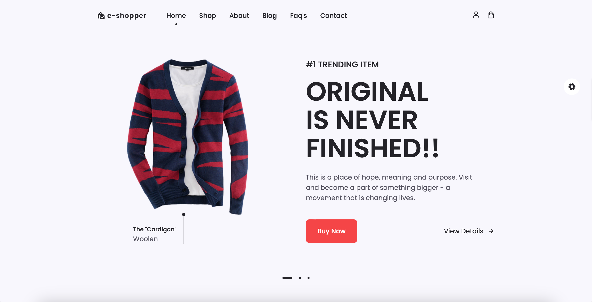
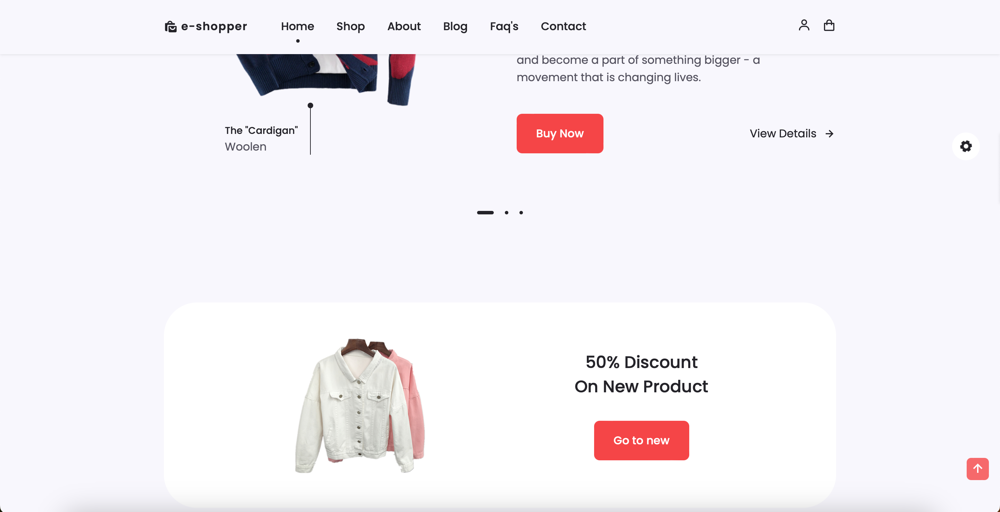

# e-Shopper

Welcome to e-Shopper, your go-to online destination for a seamless and enjoyable shopping experience. Built with JavaScript, HTML, and CSS, e-Shopper combines stylish design with intuitive functionality. Explore our diverse range of features, from a blog and cart to contact, details, FAQ, registration, and a fully-equipped shop. Check out our latest offerings and embark on your online shopping journey!

## Table of Contents

- [Demo](#demo)
- [Features](#features)
- [Installation](#installation)
- [Usage](#usage)
- [Contributing](#contributing)
- [License](#license)

## Demo

<div style="display: flex; justify-content: space-between; margin-bottom: 10px">
  
  
</div>

[Live Demo](https://e-shoppar.netlify.app)

## Features

- **Responsive Design**: Enjoy a seamless shopping experience on all devices.
- **Swiper Integration**: Navigate through featured products with a sleek Swiper slider.
- **Boxicons Icons**: Stylish and intuitive icons for a modern interface.
- **Blog Section**: Stay updated with the latest trends and news in our blog.
- **Shopping Cart**: Easily manage and review your selected items in the cart.
- **Contact Form**: Reach out to us effortlessly using the contact form.
- **Product Details**: Dive into comprehensive details for each product.
- **FAQ Section**: Get answers to common queries in our FAQ section.
- **User Registration**: Create an account for personalized shopping.
- **Full-Fledged Shop**: Explore and purchase products from our diverse inventory.

## Installation

1. Clone the repository:

   ```bash
   git clone https://github.com/Oxygeeeen/e-Shopper.git
   ```

2. Open the `index.html` file in your preferred browser.

## Usage

1. Navigate through the different sections using the navigation menu.
2. Browse products, add them to your cart, and proceed to checkout.
3. Explore the blog, contact us, and register for an enhanced experience.

## Contributing

1. Fork the repository.
2. Create a new branch: `git checkout -b feature-name`.
3. Make your changes and commit them: `git commit -m 'Add some feature'`.
4. Push to the branch: `git push origin feature-name`.
5. Open a pull request.

## License

This project is licensed under the [MIT License](https://opensource.org/licenses/MIT). 
```
Happy shopping! 🛍️ 🎈
```